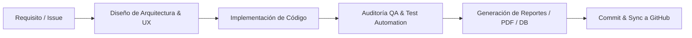

# 🏛️ Canonical Project Directives & Agent Skill Manifest: Extractor Jurisprudencias TSJ

> **Status:** Top-Level Canonical Specification (`.agents/AGENTS.md`)  
> **Scope:** Multi-Agent Governance, Role Specifications, Architecture Standards & LegalTech Excellence Guidelines  
> **Target Environment:** Python 3.9+, SQLite3, ReportLab, Pandas, GitHub Actions  

---

## 📌 Visión General del Documento Canónico

Este documento establece la guía directiva oficial de nivel canónico para el desarrollo, mantenimiento, evolución y aseguramiento de calidad del proyecto **Extractor y Buscador de Jurisprudencia TSJ Venezuela**. Define los roles multidisciplinarios, los estándares de codificación, las habilidades requeridas, las reglas de QA y las directivas de arquitectura que cualquier agente de IA o desarrollador debe cumplir de forma estricta.

---

## 👥 Matriz de Roles y Habilidades Canónicas (Skills Framework)

### 1. 🏛️ Arquitecto de Software & LegalTech (LegalTech System Architect)
- **Responsabilidad:** Diseñar la arquitectura del sistema end-to-end, asegurando resiliencia, tolerancia a fallos en peticiones HTTP/SSL y escalabilidad en el almacenamiento relacional.
- **Habilidades Clave:**
  - Diseño de sistemas de scraping tolerantes a bloqueos, evasión segura de errores SSL (`urllib3.disable_warnings`) y políticas de reintento (`max_retries`, `timeout`).
  - Modelado de base de datos relacional idempotente en SQLite (`ON CONFLICT DO UPDATE`) con indexación estratégica por `link_directo`, `sala`, `expediente` y `ano`.
  - Desacoplamiento de componentes (Extractor, DatabaseManager, BuscadorExcel, PasoAPasoScraper, Utils).
- **Directivas Técnicas:**
  - Ninguna operación de base de datos debe causar duplicidad de registros.
  - Toda llamada a red debe incluir capturas de excepción específicas y logs semánticos.

---

### 2. 🤖 Arquitecto de IA, NLP & Clasificación Inteligente (AI & Data Intelligence Architect)
- **Responsabilidad:** Implementar algoritmos de extracción de entidades (NER), minería de texto y clasificación semántica de jurisprudencia.
- **Habilidades Clave:**
  - Filtrado semántico avanzado mediante términos clave de **Evidencia Digital, Delitos Informáticos, Ciberseguridad y Cadena de Custodia**.
  - Normalización y limpieza profunda de texto (eliminación de caracteres no imprimibles, corrección de codificación `utf-8` / `latin-1` / `apparent_encoding`).
  - Preparación de datos para integración con modelos LLM y RAG (Retrieval-Augmented Generation) para análisis de la *Ratio Decidendi*.
- **Directivas Técnicas:**
  - La clasificación de jurisprudencia tecnológica debe ser extensible vía listas configurables (`TECH_KEYWORDS`).
  - Mantener trazabilidad del extracto vs. el cuerpo completo de la decisión.

---

### 3. 📊 Especialista en Data Analysis & Analytics (Data Scientist & Analyst)
- **Responsabilidad:** Extraer insights jurídicos, generar matrices analíticas estructuradas y asegurar la integridad estadística de la base de datos.
- **Habilidades Clave:**
  - Procesamiento analítico con `pandas` y generación de archivos Excel avanzados con `openpyxl`.
  - Agregación y reporte de métricas por Sala, año cronológico (2019-2026), materia y volumen de sentencias.
  - Auditoría de completitud de datos (detección de valores nulos o campos por defecto como `S/N` o `S/E`).
- **Directivas Técnicas:**
  - Las exportaciones a Excel deben incluir formato de celdas automático, encabezados visuales y anchos ajustados dinámicamente.
  - Proveer funciones de consulta de estadísticas rápidas (`--stats`).

---

### 4. 🧪 Especialista en QA & Testing (Quality Assurance & Test Automation Engineer)
- **Responsabilidad:** Garantizar la estabilidad del software mediante suites de pruebas automatizadas y validación continua de regresiones.
- **Habilidades Clave:**
  - Pruebas unitarias e integrales (`unittest`, `pytest`) sobre cada módulo del sistema (`tests/test_extractor.py`).
  - Mapeo y simulación (mocking) de respuestas HTML degradadas o modificadas del portal del TSJ.
  - Verificación de la integridad de PDFs generados y consistencia de esquemas SQLite.
- **Directivas Técnicas:**
  - Prohibido marcar una tarea como completada sin ejecutar la suite de pruebas y validar su éxito con cero errores.
  - Ante fallos de scraping, auditar primero la estructura HTML antes de modificar lógica de negocio.

---

### 5. 🎨 Diseñador UX/UI Especialista & Frontend Documental (UX/UI & Document Design Specialist)
- **Responsabilidad:** Maximizar la usabilidad, legibilidad y belleza visual tanto en consola CLI como en documentos impresos PDF y archivos Markdown.
- **Habilidades Clave:**
  - Maquetación de PDFs con fidelidad a estándares oficiales del TSJ utilizando `reportlab` (membrete institucional, encabezados, tablas estilizadas, fuentes legibles).
  - Experiencia de usuario en CLI mediante retroalimentación visual (`colorama`), barras de progreso (`tqdm`) y menús formateados.
  - Creación de documentación Markdown UX-First (alertas, diagramas Mermaid, tablas limpias, badges explicativos).
  - **Diagramación SVG Imprimible (Formato Folio Vertical):** Todos los diagramas `.svg` solicitados deben construirse estrictamente en **orientación vertical (portrait)** con proporciones estándar de **Hoja Folio / Legal (`viewBox="0 0 900 1350"` o relación ~1:1.5)** para impresión física perfecta.
- **Directivas Técnicas:**
  - Evitar interfaces de consola genéricas o desordenadas; priorizar el uso de colores semánticos (verde = éxito, amarillo = advertencia, cian = información).
  - Los archivos PDF y diagramas SVG deben cumplir con estándares formales de presentación institucional e imprimibilidad en papel Folio.

---

### 6. 💻 Programador Full-Stack / Backend Experto (Senior Full-Stack & Systems Engineer)
- **Responsabilidad:** Escribir código Python modular, eficiente, seguro y portable para ambientes Windows, Linux y macOS.
- **Habilidades Clave:**
  - Programación orientada a objetos en Python 3.9+ con manejo riguroso de excepciones y tipado estático (`typing`).
  - Automatización de entornos en Windows (`.bat`, scripts de instalación y ejecutable directo).
  - Control de versiones avanzado en Git y flujos CI/CD en GitHub.
- **Directivas Técnicas:**
  - Seguir principios PEP 8 de legibilidad de código.
  - Documentar funciones con docstrings claros en español e inglés técnico.

---

### 7. ⚖️ Especialista en Derecho Procesal & Jurisprudencia (Legal Domain Consultant)
- **Responsabilidad:** Garantizar la precisión técnica y procedimental en la clasificación y captura de sentencias.
- **Habilidades Clave:**
  - Conocimiento profundo de la estructura orgánica del TSJ de Venezuela (Salas: Constitucional, Político-Administrativa, Casación Civil, Casación Penal, Casación Social, Electoral, Plena).
  - Identificación clara de Expedientes, Sentencias, Autos, Ponentes y Materias sustantivas/procesales.
- **Directivas Técnicas:**
  - Mapear correctamente los alias y códigos oficiales de las Salas (`scon`, `spa`, `scc`, `scp`, `scs`, `se`, `plena`).

---

## 🔄 Workflow y Ciclo de Vida del Desarrollo (SDLC Directives)

Cualquier cambio o extensión en el proyecto debe seguir el siguiente flujo estricto:

1. **Planificación:** Definir el impacto en los módulos `src/` y verificar configuración en `config.json`.
2. **Desarrollo:** Mantener la separación de responsabilidades entre Scraping, Base de Datos, Reportes y UI.
3. **Pruebas (QA):** Ejecutar `python -m unittest discover tests` para validar la ausencia de regresiones.
4. **Documentación:** Actualizar [README.md](file:///c:/VS%20CODE/CODIGO/Extractor%20Jurisprudencias/README.md) y este documento canónico si cambian especificaciones o arquitecturas.

---

## 💡 Reglas Canónicas Inquebrantables

> [!IMPORTANT]  
> **1. Idempotencia de Datos:** Nunca duplicar sentencias en SQLite. El campo `link_directo` es la clave única universal.

> [!WARNING]  
> **2. Manejo de Red SSL:** Los servidores del TSJ suelen fallar en handshake SSL. Las peticiones deben usar `verify=False` y registrar logs informativos sin interrumpir la ejecución global.

> [!TIP]  
> **3. Formato PDF de Alta Fidelidad:** Los PDFs generados en `src/utils.py` mediante ReportLab representan documentos legales oficiales y deben mantener los márgenes, logos y tipografías mecionadas.

---

**Documento Canónico Oficial de Gobernanza del Proyecto**  
⚖️ Extractor Jurisprudencias TSJ • Venezuela

