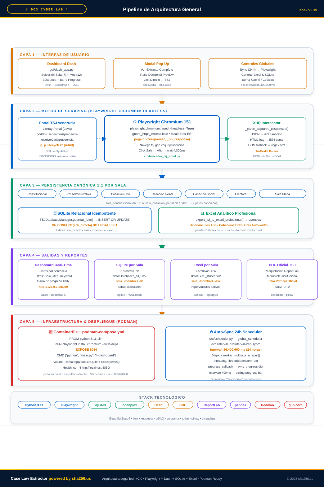
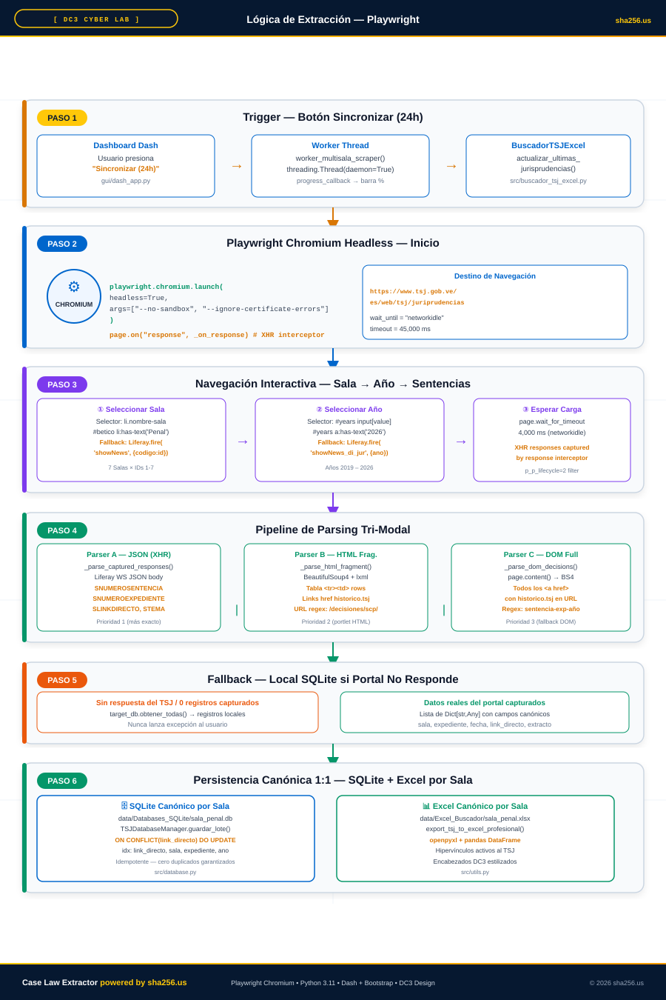
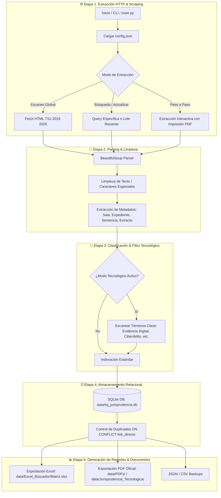

# ⚖️ Case Law Extractor powered by sha256.us

[](https://www.python.org/)
[](https://www.sqlite.org/)
[](https://pandas.pydata.org/)
[](https://www.reportlab.com/)
[](#)

Sistema automatizado de **Scraping, Indexación, Búsqueda y Extracción de Decisiones Jurisprudenciales** del Tribunal Supremo de Justicia (TSJ) de Venezuela. 

**`Case Law Extractor powered by sha256.us`** ha sido diseñado para realizar escaneos globales masivos de todas las Salas (2019-2026), almacenar la información estructurada en una base de datos relacional SQLite local, generar matrices analíticas en Excel (`.xlsx`), e imprimir sentencias en archivos PDF formateados con estándares visuales oficiales del TSJ.

---

## 📑 Tabla de Contenidos
1. [📌 Descripción General](#-descripción-general)
2. [🔄 Pipeline de Funcionamiento (Workflow)](#-pipeline-de-funcionamiento-workflow)
3. [✨ Características Principales](#-características-principales)
4. [📁 Estructura del Proyecto](#-estructura-del-proyecto)
5. [🛠️ Requisitos e Instalación](#️-requisitos-e-instalación)
6. [🚀 Guía de Uso](#-guía-de-uso)
7. [⚙️ Configuración (`config.json`)](#️-configuración-configjson)
8. [🗄️ Esquema de la Base de Datos (SQLite)](#️-esquema-de-la-base-de-datos-sqlite)
9. [🏛️ Cobertura de Salas del TSJ](#️-cobertura-de-salas-del-tsj)
10. [💡 Buenas Prácticas y Consejos](#-buenas-prácticas-y-consejos)

---

## 📌 Descripción General

El **Extractor de Jurisprudencias TSJ** automatiza la recolección de decisiones del portal oficial del TSJ. Reemplaza la búsqueda manual mediante la extracción metódica de campos clave: **Número de Sentencia, Expediente, Fecha, Sala, Tema, Materia, Asunto/Extracto y Enlaces Directos**.

> [!NOTE]  
> El sistema incluye un módulo especializado en **Jurisprudencia Tecnológica**, optimizado para la identificación y clasificación de sentencias vinculadas a **Evidencia Digital, Delitos Informáticos, Peritajes Tecnológicos y Cadena de Custodia Electrónica**.

---

## 🔄 Pipeline de Funcionamiento (Workflow)

El flujo de trabajo está diseñado en **5 etapas secuenciales** altamente optimizadas para garantizar tolerancia a fallos, procesamiento limpio de datos e indexación rápida.

### 📐 Diagramas Vectoriales HD (Arquitectura & Scraping)



<br/>



---

### 📊 Diagrama de Secuencia de Datos



### Detalle por Etapas del Scraper:

| Etapa | Nombre | Descripción de Secuencia | Tecnologías Utilizadas |
| :--- | :--- | :--- | :--- |
| **Etapa 1** | **Scraping HTTP** | Consultas automatizadas al portal web del TSJ con manejo de reintentos, timeouts y evasión de bloqueos SSL. | `requests`, `urllib3` |
| **Etapa 2** | **Parsing & Pop-Up** | Identificación de la lista de sentencias, extracción del enlace bajo `"Ver Extracto:"` y apertura de la ventana emergente Pop-Up. | `BeautifulSoup4`, `lxml`, `re` |
| **Etapa 3** | **Verificación NLP** | Verificación de la relevancia del extracto (Ratio Decidendi) obtenido en el Pop-Up frente a los filtros de tecnología o búsqueda. | Regex, Custom Algorithms |
| **Etapa 4** | **Copiado de URL & DB** | Copiado de la URL que abrió el Pop-Up como `link_directo` en SQLite DB atómica sin duplicados (`ON CONFLICT DO UPDATE`). | `sqlite3` (Tabla `decisiones`) |
| **Etapa 5** | **Exportación UX** | Exportación emparejada 1:1 en Excel (`.xlsx`) con hipervínculos azules clicables y maquetación de sentencias en PDF oficial. | `pandas`, `openpyxl`, `reportlab` |

---

## ✨ Características Principales

- **🌐 Escaneo Multisala Global (2019 - 2026):** Recorre automáticamente las 7 Salas del TSJ indexando miles de decisiones.
- **⚡ Base de Datos SQLite Integrada:** Almacena y actualiza los registros sin duplicar datos gracias a índices en `link_directo`, `expediente`, `sala` y `ano`.
- **📊 Matriz Analítica Excel (.xlsx):** Genera libros de trabajo con formato visual, encabezados estilizados y anchos de columna autoajustados.
- **📑 Generación de PDF Oficiales (ReportLab):** Crea documentos PDF listos para imprimir con encabezado oficial del TSJ, membrete institucional, tablas de metadatos y maquetación jurídica formal.
- **🛡️ Módulo de Jurisprudencia Tecnológica:** Filtra y clasifica sentencias clave sobre peritajes informáticos, delitos cibernéticos, evidencia digital y redes sociales.
- **💻 CLI Interactivo & Menú Colorama:** Interfaz gráfica en consola intuitiva con barra de progreso (`tqdm`) y colores semánticos (`colorama`).

---

## 📁 Estructura del Proyecto

```text
case-law-extractor/
├── config.json                     # Configuración principal (salas, años, límites, rutas)
├── main.py                         # Punto de entrada y CLI interactivo (DC3 Style)
├── iniciar_dashboard_web.bat       # Lanzador directo del Dashboard Web 100% Python (http://127.0.0.1:8050/)
├── ejecutar_extractor.bat          # Gestor interactivo CLI de operaciones del proyecto
├── create_bat.py                   # Generador de archivos .bat dedicados con codificación CRLF
├── requirements.txt                # Dependencias de Python (Dash, Pandas, ReportLab, etc.)
│
├── src/                            # Código fuente del núcleo
│   ├── extractor.py                # Orquestador principal de scraping e indexación
│   ├── database.py                 # TSJDatabaseManager (Indexación SQLite relacional idempotente)
│   ├── buscador_tsj_excel.py       # Motor de búsqueda y generación de matrices Excel Canónicas
│   ├── scheduler.py                # Programador de sincronización automática de 24 horas (Auto-Updater)
│   ├── paso_a_paso_scraper.py      # Extractor guiado paso a paso con ventana emergente y PDF
│   └── utils.py                    # Utilidades de red, parsing HTML, maquetación PDF e identificadores por Sala
│
├── gui/                            # Interfaz gráfica de usuario (Web Dashboard)
│   ├── dash_app.py                 # Dashboard reactivo 100% Python (Dash + Bootstrap + DC3 Style)
│   ├── server.py                   # Servidor proxy local HTTP
│   ├── index.html                  # Interfaz HTML standard imprimible
│   └── app.js                      # Cliente JavaScript con búsqueda instantánea debounced y borrado de caché
│
├── data/                           # Directorio de persistencia de datos (auto-generado)
│   ├── Databases_SQLite/           # Bases de datos SQLite Canónicas por Sala (sala_<nombre>.db)
│   ├── Excel_Buscador/             # Matrices Excel Canónicas por Sala (sala_<nombre>.xlsx)
│   ├── test_output/                # Salida de pruebas, PDFs e informes temporales
│   └── PDFs/                       # Sentencias extraídas en PDF oficial
│
├── assets/                         # Hojas de estilo CSS y logo_sha256.svg
└── tests/                          # Suite de pruebas unitarias (test_extractor.py, test_scheduler.py)
```

---

## 🛠️ Requisitos, Dependencias y Puesta en Marcha

### 📋 Prerrequisitos del Sistema
- **Python 3.9** o superior ([Descargar Python](https://www.python.org/downloads/)).
- **Git** ([Descargar Git](https://git-scm.com/)).
- Conexión a Internet activa para realizar peticiones al portal del TSJ.

---

### 📦 Dependencias del Proyecto (`requirements.txt`)

Todas las dependencias necesarias están especificadas en `requirements.txt`. A continuación se detalla el propósito de cada paquete:

| Paquete | Versión Mínima | Propósito / Función en el Proyecto |
| :--- | :--- | :--- |
| `requests` | `>= 2.31.0` | Cliente HTTP para realizar scraping y descargas desde el portal del TSJ. |
| `beautifulsoup4` | `>= 4.12.0` | Parser del DOM HTML para extraer metadatos de las sentencias. |
| `lxml` | `>= 4.9.0` | Motor de parsing C de alto rendimiento para procesar HTML complejo. |
| `pandas` | `>= 2.0.0` | Estructuración y manipulación de datos en dataframes analíticos. |
| `openpyxl` | `>= 3.1.0` | Generación y formateo de libros de trabajo Excel (`.xlsx`). |
| `colorama` | `>= 0.4.6` | Formato visual con colores semánticos en la interfaz de consola CLI. |
| `tqdm` | `>= 4.66.0` | Barras de progreso animadas en la terminal durante el escaneo. |
| `reportlab` | `>= 4.0.0` | Motor de maquetación y generación de documentos PDF con formato oficial. |
| `pillow` | `>= 10.0.0` | Procesamiento e inserción de imágenes/emblemas en los encabezados PDF. |
| `dash` | `>= 2.14.0` | Framework web reactivo 100% Python para el Dashboard en tiempo real. |
| `dash-bootstrap-components` | `>= 1.5.0` | Maquetación web nativa en Python con Bootstrap 5 e interfaz estilo DC3 Cyber Center. |

---

### 🏁 Guía Paso a Paso para Poner en Marcha el Proyecto

Sigue estos 6 pasos detallados para clonar, configurar y ejecutar el proyecto desde cero en cualquier equipo:

#### Paso 1: Clonar el Repositorio
Abre tu terminal o PowerShell y ejecuta:
```bash
git clone https://github.com/julljoll/case-law-extractor.git
cd case-law-extractor
```

#### Paso 2: Crear el Entorno Virtual (`venv`)
Es recomendable aislar las dependencias dentro de un entorno virtual:

- **En Windows (PowerShell / CMD):**
  ```powershell
  python -m venv venv
  ```
- **En Linux / macOS:**
  ```bash
  python3 -m venv venv
  ```

#### Paso 3: Activar el Entorno Virtual

- **En Windows (PowerShell):**
  ```powershell
  .\venv\Scripts\Activate.ps1
  ```
  *(Si PowerShell bloquea los scripts, ejecuta antes: `Set-ExecutionPolicy Unrestricted -Scope Process`)*

- **En Windows (CMD):**
  ```cmd
  venv\Scripts\activate.bat
  ```

- **En Linux / macOS:**
  ```bash
  source venv/bin/activate
  ```

#### Paso 4: Instalar las Dependencias
Con el entorno virtual activado, instala todos los paquetes requeridos con un solo comando:
```bash
pip install --upgrade pip
pip install -r requirements.txt
```

#### Paso 5: Generar Recursos Visuales e Inicializar Entorno
Ejecuta el script auxiliar para verificar la creación del emblema institucional para los documentos PDF:
```bash
python src/create_assets.py
```
*(Este comando generará el archivo `assets/escudo_venezuela.png` necesario para los reportes PDF).*

#### Paso 6: Ejecutar el Sistema

- **Opción A: Dashboard Web 100% Python (Dash + Bootstrap - Recomendado)**
  ```bash
  python main.py --dash
  # O bien directamente:
  python gui/dash_app.py
  ```
  *Abre tu navegador en: `http://127.0.0.1:8050/`*

- **Opción B: Modo Menú Interactivo (Consola)**
  ```bash
  python main.py
  ```

- **Opción C: Lanzador Automático en Windows**
  Hacer doble clic en `ejecutar_extractor.bat` o ejecutarlo desde la terminal:
  ```cmd
  ejecutar_extractor.bat
  ```

---

### ⚡ Solución de Problemas Frecuentes (Troubleshooting)

> [!WARNING]  
> **Error SSL Handshake (`SSLCertVerificationError`):**  
> El servidor del TSJ a menudo presenta inconsistencias SSL. El proyecto ya incluye `verify=False` en las peticiones HTTP y desactiva las advertencias con `urllib3.disable_warnings()`, por lo que no requiere configuración adicional de certificados.

> [!TIP]  
> **Permisos de Ejecución de Scripts `.bat` en Windows:**  
> Si Windows bloquea la ejecución de `ejecutar_extractor.bat`, haz clic derecho sobre el archivo -> *Propiedades* -> marca la casilla **Desbloquear** (*Unblock*) -> *Aplicar*.

---

## 🚀 Guía de Uso

El proyecto puede ejecutarse de manera **web interactiva**, **menú de consola** o **comandos directos CLI**.

### 1. Menú Interactivo (Recomendado)

Simplemente ejecuta `main.py` sin argumentos:

```bash
python main.py
```

Aparecerá el menú interactivo en consola con la opción del Dashboard Web y selección por Sala (0-7) y Mes (0-12):

```text
==============================================================================
  [BUSCADOR Y BASE DE DATOS DE JURISPRUDENCIA TSJ VENEZUELA (2019 - 2026)
  Generación de BD SQLite + Matriz Excel (.xlsx) Dedicadas por Fórmula
=============================================================================

Seleccione la opción deseada:
  [1] Escaneo Global / Específico de Páginas del TSJ ➔ Escaneo_<Sala>_<Mes>.db + .xlsx
  [2] Actualizar Base de Datos de Últimas Jurisprudencias ➔ Actualizacion.db + .xlsx
  [3] Búsqueda por Fórmula / Palabra Clave / Expediente ➔ Genera BD SQLite + Excel Dedicados
  [4] Inspeccionar Estadísticas de Todas las Bases de Datos SQLite Generadas
  [5] Extracción Guiada Paso a Paso (Ventana Emergente e Impresión PDF)
  [6] INICIAR DASHBOARD WEB 100% PYTHON (http://127.0.0.1:8050/ - Dash + Bootstrap)
  [7] Salir
```

### 2. Argumentos por Línea de Comandos (CLI)

| Opción / Flag | Descripción | Comando Ejemplo |
| :--- | :--- | :--- |
| `-g` / `--global` | Ejecuta el escaneo global de todas las salas (2019-2026). | `python main.py -g` |
| `-u` / `--actualizar` | Sincroniza y actualiza la base de datos con las sentencias más recientes. | `python main.py -u` |
| `--stats` / `--db` | Muestra estadísticas y número de registros en SQLite. | `python main.py --db` |
| `-p` / `--paso-a-paso` | Ejecuta el extractor en modo paso a paso con impresión en PDF. | `python main.py -p` |
| `<archivo_config.json>` | Ejecuta el extractor utilizando un archivo JSON personalizado. | `python main.py config.json` |

### 3. Ejecución Directa en Windows (Archivos `.bat` Dedicados)

El proyecto cuenta con dos accesos directos en archivos batch:
- **`iniciar_dashboard_web.bat`**: Activa el entorno virtual y arranca directamente la interfaz web en tu navegador (`http://127.0.0.1:8050/`).
- **`ejecutar_extractor.bat`**: Gestor táctico de consola para administrar búsquedas, escaneos masivos por Sala y Mes, estadísticas SQLite y suite de pruebas unitarias.

---

## ⚙️ Configuración (`config.json`)

El comportamiento del extractor se controla mediante el archivo `config.json`:

```json
{
  "sala": "Sala Constitucional",
  "sala_id": "constitucional",
  "ano": 2026,
  "ano_inicio": 2019,
  "ano_fin": 2026,
  "palabra_clave": "",
  "limite": 20,
  "formato_salida": "excel",
  "carpeta_salida": "data/PDFs",
  "carpeta_excel": "data/Excel_Buscador",
  "descargar_pdf_directo": false,
  "modo_tecnologia": true,
  "escanear_todas_las_salas": true,
  "carpeta_tecnologia": "data/Jurisprudencia_Tecnologica"
}
```

### Descripción de Parámetros:

> [!TIP]  
> Modifica `ano_inicio` y `ano_fin` en `config.json` para acotar los rangos de búsqueda cuando requieras análisis específicos por período.

| Campo | Tipo | Descripción |
| :--- | :--- | :--- |
| `sala_id` | `string` | Identificador de la sala por defecto (`constitucional`, `casacion_penal`, `casacion_civil`, etc.). |
| `ano_inicio` / `ano_fin` | `integer` | Rango cronológico para el escaneo masivo de sentencias. |
| `limite` | `integer` | Límite máximo de sentencias a procesar por consulta en modo manual. |
| `modo_tecnologia` | `boolean` | Si es `true`, activa el filtro y guardado prioritario de casos sobre tecnología y evidencia digital. |
| `escanear_todas_las_salas` | `boolean` | Recorre secuencialmente las 7 Salas del TSJ en escaneos automáticos. |
| `carpeta_excel` | `string` | Ruta donde se exportarán los archivos `.xlsx` compilados. |
| `carpeta_tecnologia` | `string` | Ruta de salida para los PDFs catalogados en la categoría de tecnología. |

---

## 🗄️ Esquema de Bases de Datos SQLite Dedicadas

Cada búsqueda o fórmula ejecutada genera una base de datos SQLite independiente ubicada en `data/Databases_SQLite/` que se empareja 1:1 con su correspondiente libro de trabajo en Excel en `data/Excel_Buscador/`.

**Ejemplos de archivos emparejados generados:**
- Búsqueda: `"delitos informáticos"` -> `data/Databases_SQLite/Busqueda_delitos_informaticos.db` y `data/Excel_Buscador/Busqueda_delitos_informaticos.xlsx`
- Escaneo Global: -> `data/Databases_SQLite/Escaneo_Global_TSJ_2019_2026.db` y `data/Excel_Buscador/Escaneo_Global_TSJ_2019_2026.xlsx`

### Tabla: `decisiones`

```sql
CREATE TABLE IF NOT EXISTS decisiones (
    id INTEGER PRIMARY KEY AUTOINCREMENT,
    sala TEXT NOT NULL,
    numero_sentencia TEXT,
    expediente TEXT,
    fecha TEXT,
    ano INTEGER,
    tema TEXT,
    materia TEXT,
    asunto TEXT,
    extracto TEXT,
    link_directo TEXT UNIQUE,
    fecha_escaneo TIMESTAMP DEFAULT CURRENT_TIMESTAMP
);
```

### Índices de Rendimiento:
- `idx_link_directo`: Búsqueda rápida por URL y prevención de duplicados (`UNIQUE`).
- `idx_sala`: Filtro optimizado por Sala.
- `idx_expediente`: Consultas ágiles por número de expediente.
- `idx_ano`: Agrupación y reportes cronológicos.

---

## 🏛️ Cobertura de Salas del TSJ

El extractor cubre la totalidad de las salas jurisdiccionales del Tribunal Supremo de Justicia de Venezuela:

| Clave (`sala_id`) | Nombre Oficial de la Sala | Código TSJ |
| :--- | :--- | :--- |
| `constitucional` | **Sala Constitucional** | `scon` |
| `politico_administrativa` | **Sala Político-Administrativa** | `spa` |
| `casacion_civil` | **Sala de Casación Civil** | `scc` |
| `casacion_penal` | **Sala de Casación Penal** | `scp` |
| `casacion_social` | **Sala de Casación Social** | `scs` |
| `electoral` | **Sala Electoral** | `se` |
| `plena` | **Sala Plena** | `plena` |

---

## 💡 Buenas Prácticas y Consejos

> [!IMPORTANT]  
> **Conexión al Portal del TSJ:** El sitio oficial del TSJ a menudo utiliza certificados SSL autofirmados o desactualizados. El extractor omite las advertencias SSL inseguras de forma segura para evitar interrupciones en las consultas.

> [!WARNING]  
> **Reintentos y Rate Limiting:** En escaneos globales masivos, asegúrate de mantener un `timeout` prudente (configurado por defecto en 15s) para evitar que el servidor remoto del TSJ rechace peticiones por exceso de tráfico.

> [!TIP]  
> **Generación de PDFs Oficiales:** Para obtener documentos PDF idénticos a los dictámenes oficiales, asegúrate de tener la librería `reportlab` instalada y actualizada.

---

<div align="center">

**Desarrollado para la Automatización y Análisis Jurídico Avanzado**  
⚖️ Extractor Jurisprudencias TSJ • Venezuela

</div>
